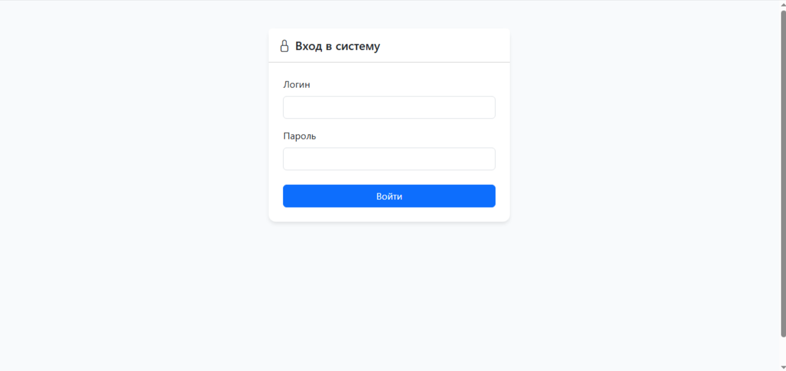
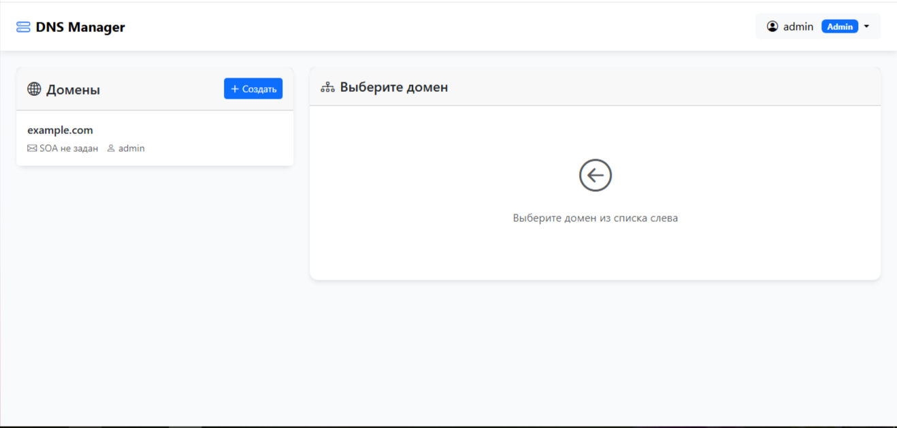
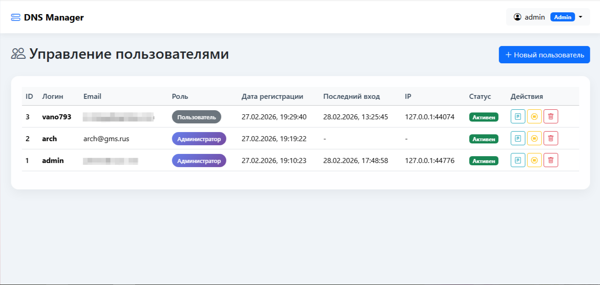

```markdown
# DNS Manager

**DNS Manager** — это простая и удобная панель управления DNS-зонами на базе NSD, написанная на Go. Позволяет создавать домены, управлять DNS-записями (A, AAAA, CNAME, MX, NS, TXT, SOA), контролировать доступ пользователей и автоматически генерировать файлы зон для NSD.

Фото/Screenshot





---

## Возможности

- 🧑‍💼 **Ролевая модель** — администратор и обычный пользователь
- 🌐 **Управление доменами** — создание, удаление, просмотр
- 📝 **DNS-записи** — поддержка всех основных типов (A, AAAA, CNAME, MX, NS, TXT, SOA)
- ⚙️ **Интеграция с NSD** — автоматическая генерация зон и перезагрузка сервера
- 📜 **Логирование** — действия пользователей и попытки входа
- 🛠️ **Многошаговый установщик** — при первом запуске
- 🔒 **Гибкие настройки прав** — ограничение создания NS/A записей для пользователей
- 📁 **Просмотр файлов зон** — администратор может видеть все сгенерированные файлы .zone

---

## Системные требования

- **ОС:** Linux (рекомендуется Ubuntu 20.04+ / Debian 11+)
- **Go:** версия 1.21 или выше (только для сборки из исходников)
- **NSD:** версия 4.x (если планируется интеграция)
- **SQLite3:** встроенная, дополнительной установки не требует

---

## Установка

### Вариант 1: Установка из готового бинарного файла

1. Скачайте последнюю версию бинарного файла для вашей архитектуры из раздела [Releases](https://github.com/vano793/dns-manager/releases).
2. Поместите бинарный файл, например, в `/opt/dns-manager/` и сделайте его исполняемым:
   ```bash
   mkdir -p /opt/dns-manager
   mv dns-manager /opt/dns-manager/
   chmod +x /opt/dns-manager/dns-manager
   ```
3. Создайте необходимые директории для логов и зон:
   ```bash
   mkdir -p /opt/dns-manager/logs
   mkdir -p /opt/dns-manager/zones
   ```
4. Запустите DNS Manager вручную для первоначальной настройки:
   ```bash
   cd /opt/dns-manager
   ./dns-manager
   ```
   При первом запуске будет создан файл `config.yaml` и запущен установщик (доступен по адресу `http://ваш-сервер:8080/install`). Следуйте инструкциям.
5. Настройте автозапуск через systemd (см. раздел **Настройка автозапуска**).

### Вариант 2: Сборка из исходников

1. Клонируйте репозиторий:
   ```bash
   git clone https://github.com/vano793/dns-manager.git
   cd dns-manager
   ```
2. Установите зависимости и соберите проект:
   ```bash
   go mod tidy
   CGO_ENABLED=1 go build -o dns-manager
   ```
   > ⚠️ Флаг `CGO_ENABLED=1` обязателен для работы с SQLite3.
3. Далее следуйте шагам 3–5 из варианта 1.

---

## Настройка автозапуска через systemd

Создайте файл `/etc/systemd/system/dns-manager.service`:

```ini
[Unit]
Description=DNS Manager
After=network.target

[Service]
Type=simple
User=root
WorkingDirectory=/opt/dns-manager
ExecStart=/opt/dns-manager/dns-manager
Restart=always
RestartSec=10
StandardOutput=journal
StandardError=journal

[Install]
WantedBy=multi-user.target
```

Затем выполните:

```bash
systemctl daemon-reload
systemctl enable dns-manager
systemctl start dns-manager
```

Проверьте статус:

```bash
systemctl status dns-manager
```

---

## Настройка интеграции с NSD

DNS Manager может автоматически создавать файлы зон в указанной директории и добавлять их в конфигурацию NSD.

### 1. Установите NSD (если ещё не установлен)

```bash
apt update && apt install nsd -y   # для Debian/Ubuntu
```

### 2. Настройте NSD для включения файла зон, генерируемого DNS Manager

Добавьте в конец файла `/etc/nsd/nsd.conf` строку:

```bash
echo 'include: "/opt/dns-manager/zones.conf"' >> /etc/nsd/nsd.conf
```

### 3. Права доступа

Убедитесь, что пользователь, от которого запускается DNS Manager, имеет право писать в директорию зон. Если используется пользователь `root`, права уже есть. Если вы запускаете от другого пользователя, скорректируйте владельца:

```bash
chown -R ваш_пользователь:ваш_пользователь /opt/dns-manager/zones
chmod 755 /opt/dns-manager/zones
```

### 4. Проверка в панели администратора

В разделе **Настройки** укажите:
- **Директория зон:** `/opt/dns-manager/zones/`
- **Файл конфигурации зон:** `/opt/dns-manager/zones.conf`
- **Включить интеграцию с NSD:** отметьте галочкой

После сохранения перезапустите DNS Manager (или всю систему).

---

## Использование

### Первый вход

1. Откройте браузер и перейдите по адресу `http://ваш-сервер:8080`.
2. Если система ещё не установлена, вы будете перенаправлены на страницу установщика. Создайте учётную запись администратора.
3. После установки войдите под созданным логином и паролем.

### Создание домена (для обычного пользователя)

1. Нажмите кнопку **«Создать»** в блоке «Домены».
2. Заполните поля:
   - **Домен** (например, `example.com`)
   - **Email администратора** (будет использован в SOA-записи)
   - **IP адрес сервера** (если разрешено администратором)
3. Нажмите **«Создать домен»**.

После этого автоматически будут созданы:
- SOA-запись
- NS-записи из глобального списка, заданного администратором
- A-запись (если IP указан и разрешено)

### Управление записями

Выберите домен из списка слева. Отобразится таблица с записями.
- **Добавить запись** — кнопка «Добавить запись» (доступна после выбора домена)
- **Редактировать** — иконка ✏️ в строке записи (недоступна для SOA)
- **Удалить** — иконка 🗑️ в строке записи (недоступна для SOA и последней NS)

### Администрирование

Для пользователей с ролью `admin` в меню (справа вверху) появляются дополнительные пункты:
- **Пользователи** — управление учётными записями (создание, блокировка, удаление, просмотр истории действий)
- **Настройки** — изменение параметров сервера, NSD, глобального списка NS-серверов, прав пользователей
- **Логи** — просмотр системного лога
- **Файлы зон** — список всех сгенерированных файлов `.zone`

---

## Параметры конфигурации (config.yaml)

Основные настройки хранятся в файле `config.yaml` в корневой директории. Пример:

```yaml
database:
  path: dns.sqlite

server:
  port: 8080
  domain: "dns.example.com"
  use_domain: false

session:
  secret: "ваш-секретный-ключ"
  secure: false
  domain: ""

nsd:
  zone_dir: "./zones/"
  zones_conf: "./zones.conf"
  enabled: true

default_ttl: 3600
server_ip: "127.0.0.1"

dns:
  ns_servers:
    - ns1.example.com
    - ns2.example.com
  soa:
    refresh: 7200
    retry: 3600
    expire: 1209600
    minimum: 3600

logging:
  level: "info"
  file: "logs/dns-manager.log"
  max_size: 100
  max_backups: 10
  max_age: 30

security:
  allow_users_create_ns: false
  allow_users_create_a: false
```

- `nsd.zone_dir` — директория для хранения файлов зон (должна быть доступна для записи)
- `nsd.zones_conf` — файл, включаемый в конфигурацию NSD
- `dns.ns_servers` — список NS-серверов, добавляемых во все новые домены
- `security.allow_users_create_ns/a` — разрешить обычным пользователям создавать NS/A записи

---

## Безопасность

- Пароли хешируются с использованием **bcrypt**.
- Сессии подписываются секретным ключом (хранится в `config.yaml`).
- Доступ к API защищён middleware: требуется аутентификация и, для административных маршрутов, роль `admin`.
- Настройки `session.secure` должны быть `true` при работе по HTTPS (рекомендуется использовать прокси, например, nginx, с HTTPS).

---

## Лицензия

Данный проект распространяется под лицензией **GNU General Public License v3 (GPLv3)**.  
Это означает, что вы можете свободно использовать, изменять и распространять программу, но обязаны сохранять ту же лицензию и открывать исходный код всех производных работ.  
Полный текст лицензии доступен в файле [LICENSE](LICENSE).

---

## Поддержка и обратная связь

Если вы нашли ошибку или у вас есть предложения по улучшению, создайте [issue](https://github.com/vano793/dns-manager/issues) на GitHub или отправьте pull request.
```

